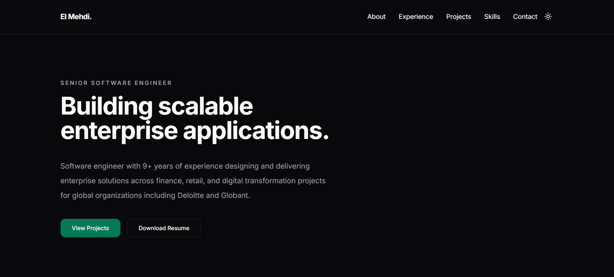

# Portfolio

A modern, performant, and accessible personal portfolio built with React, TypeScript, Vite, and Tailwind CSS.

**Live Website:** https://ebelhaj.com



---

## Overview

This project serves as my personal portfolio and demonstrates my approach to building production-ready frontend applications.

The focus is on clean architecture, accessibility, performance, maintainability, and modern user experience while following industry best practices.

---

## Highlights

- Responsive design across all screen sizes
- Dark & light themes with persisted user preference
- Accessibility-first implementation (WCAG)
- Static SEO with Open Graph & JSON-LD metadata
- Optimized performance and font loading
- Smooth animations with reduced motion support
- Feature-oriented architecture
- Reusable UI components
- Automatic deployment with Vercel

---

## Tech Stack

### Frontend

- React 19
- TypeScript
- Vite
- Tailwind CSS v4

### UI & UX

- Lucide React
- Simple Icons
- Motion

### Tooling

- ESLint
- Prettier

### Deployment

- Vercel
- GitHub

---

## Lighthouse

| Category       | Score |
| -------------- | ----: |
| Performance    |   100 |
| Accessibility  |   100 |
| Best Practices |   100 |
| SEO            |   100 |

> Desktop scores measured using Lighthouse. Mobile performance may vary depending on device and network conditions.

---

## Architecture

The project follows a feature-oriented architecture with reusable UI components and a clear separation of concerns.

```text
src/
├── app/
├── assets/
├── components/
│   ├── layout/
│   ├── ui/
│   └── motion/
├── config/
├── context/
├── data/
├── hooks/
├── lib/
├── styles/
├── types/
└── utils/
```

---

## Features

- Semantic HTML
- Responsive navigation
- Theme switcher
- Reusable component library
- Static SEO metadata
- Open Graph support
- Structured data (JSON-LD)
- Performance optimizations
- Smooth page animations
- Accessible keyboard navigation
- Automatic deployments
- Type-safe codebase

---

## Getting Started

### Clone the repository

```bash
git clone https://github.com/elmehdibelhaj/portfolio.git
```

### Install dependencies

```bash
npm install
```

### Start the development server

```bash
npm run dev
```

The application will be available at:

```text
http://localhost:5173
```

---

## Production Build

Build the application:

```bash
npm run build
```

Preview the production build locally:

```bash
npm run preview
```

---

## Deployment

The project is automatically deployed using **Vercel**.

Every push to the production branch triggers a new deployment.

Production URL:

**https://ebelhaj.com**

---

## Inspiration

The overall design philosophy is inspired by modern engineering teams and product companies that prioritize simplicity, performance, and developer experience, including:

- Vercel
- Stripe
- Linear
- GitHub
- Apple

---

## Contact

**Portfolio**

https://ebelhaj.com

**LinkedIn**

https://linkedin.com/in/ebelhaj

**GitHub**

https://github.com/elmehdibelhaj

**Email**

contact@ebelhaj.com

---

## License

This project is licensed under the MIT License.
